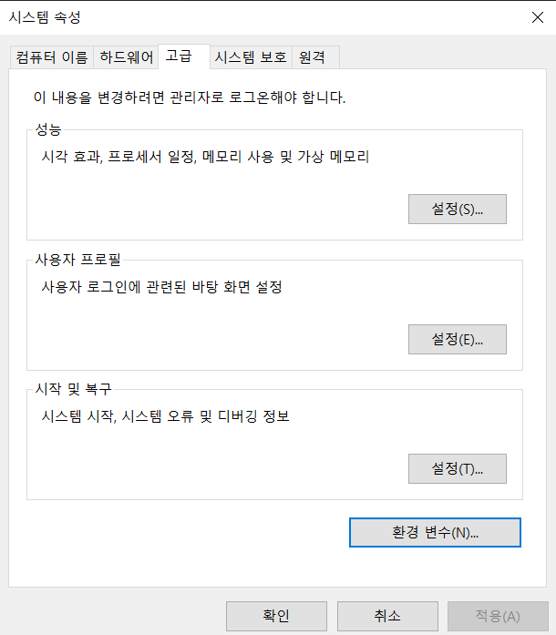
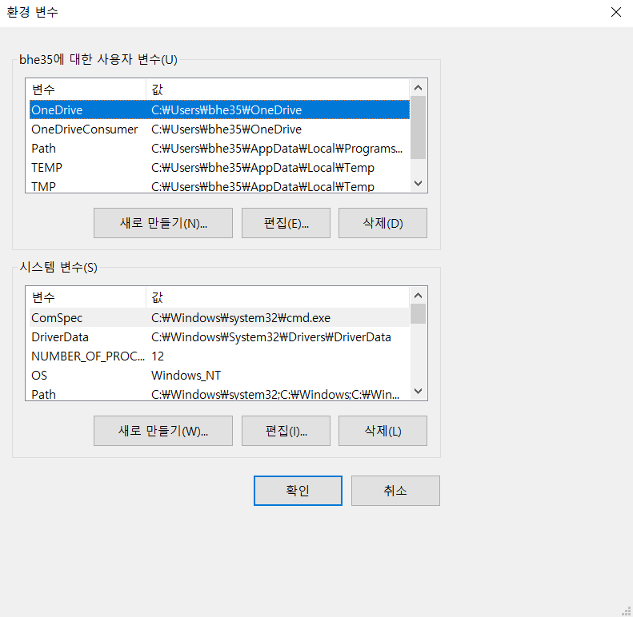
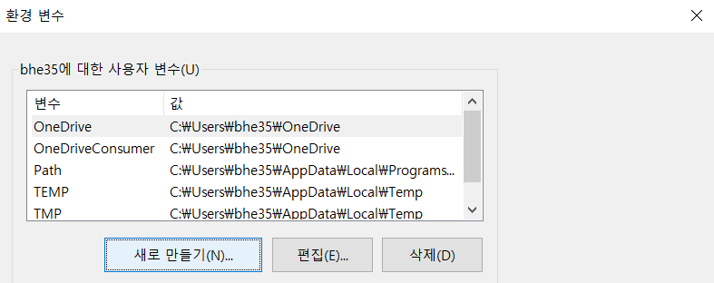
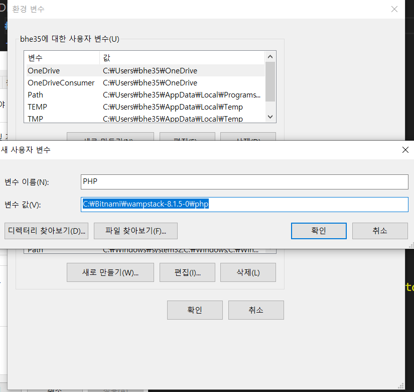
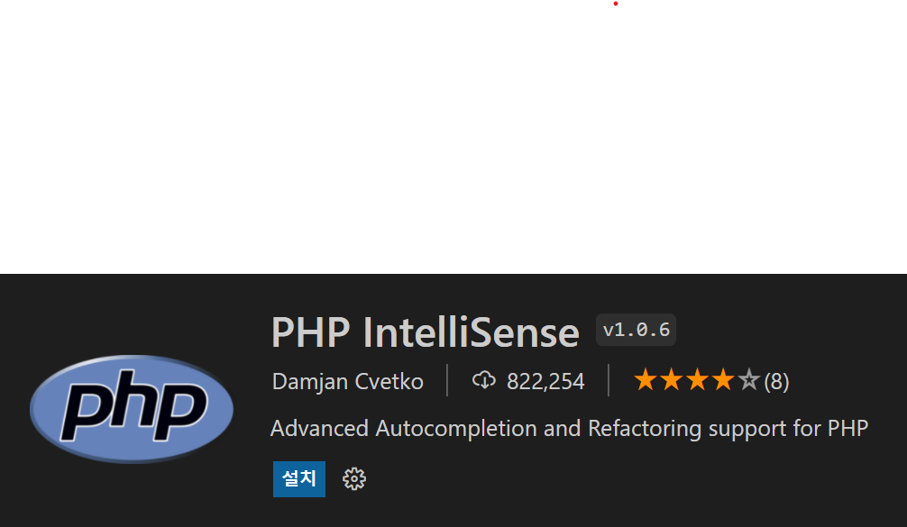
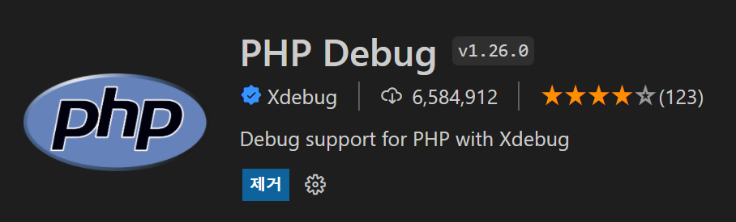
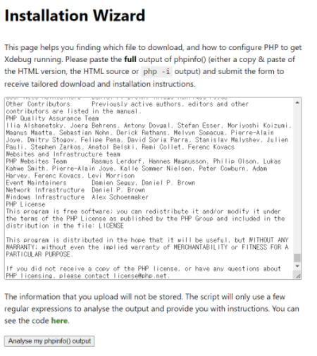
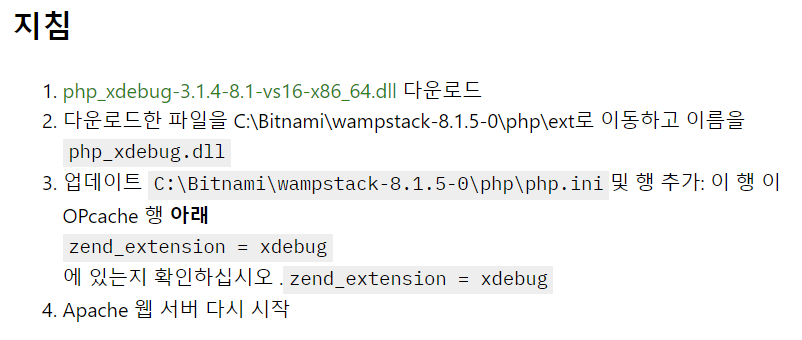

# php환경설정

01. bitnami란?
- bitnami는 가상 어플라이언스 및 웹 어플리케이션, 개발 스택용 소프트웨어 패키지 및 설치 라이브러리이다

    - WAMP(window/Apache/MySQL/PHP)   
    윈도우 환경에서 아파치, MySQL(DB), PHP(서버사이드)와 같은 웹 개발환경을 통합적으로 구축해주는 프로그램
    - MAMP(Mac/Apache/MySQL/PHP)   
    맥환경에서 아파치, MySQL(DB), PHP(서버사이드)와 같은 웹 개발환경을 통합적으로 구축해주는 프로그램

02. bitnami설치
- WAMP   
    https://bitnami.com/stack/wamp/installer

- MAMP   
    https://bitnami.com/stack/mamp

03. 환경변수
- 시스템속성에서 환경변수 클릭
   

- 사용자변수 -> 새로만들기 클릭

- 변수이름과 패스 설정후 확인
 

04. vscode 익스텐션 설치
- PHP IntelliSense 검색후 설치   

- PHP Debug 검색 후 설치   
     
    - https://xdebug.org/wizard 로 가서 
    - <?php phpinfo(); ?>내용을 전체 복사후 
    - 내용붙여넣기 후 Analyse my phpinfo() output버튼 클릭
    
    - 지침내용을 따라한다
    